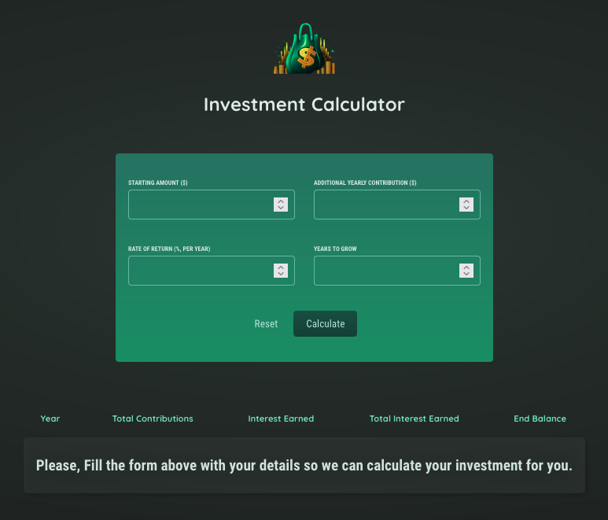
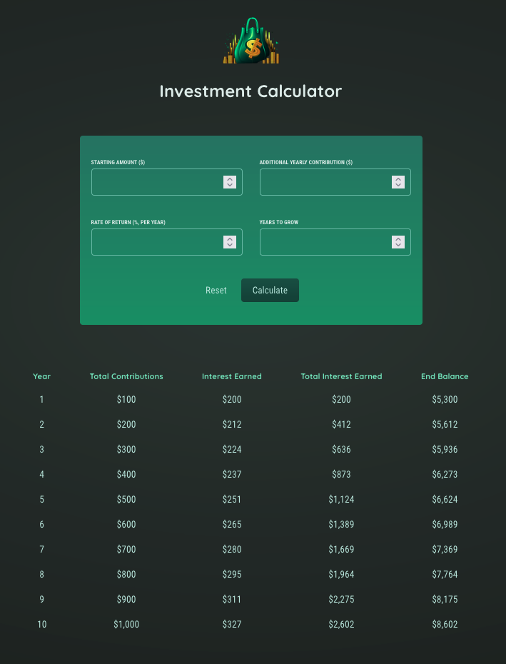

# Investment Calculator - React Project Exercise

## Overview

This project is an exercise from the Udemy course ["React - The Complete Guide 2023"](https://www.udemy.com/course/react-the-complete-guide-incl-redux/) by [Maximilian Schwarzmüller](https://www.udemy.com/user/maximilian-schwarzmuller/). The exercise primarily focused on building a React application using concepts taught in the course, including React Router and Redux. The design and main idea are inspired by Maximilian's instructions.

[Udemy Course Link](https://www.udemy.com/course/react-the-complete-guide-incl-redux/)

[Maximilian Schwarzmüller Udemy Page](https://www.udemy.com/user/maximilian-schwarzmuller/)

## My Contributions

In this exercise, I took the provided initial code from Maximilian's course and extended it by implementing all the React logic and components. During the process, I customized the calculations to make them more intuitive and easier to understand for myself. This customization was also a valuable exercise for me to practice building complex logic independently.

## Key Features

-   Calculates an investment based on constant yearly contribution and rate of return over the period of X years.

## How to Run

### Clone it to your local machine to see everything working

1. Clone the repository to your local machine.
2. Navigate to the project folder.
3. Install the dependencies using `npm install`.
4. Start the development server with `npm start`.
5. Open your web browser and go to `http://localhost:3000` to see the application in action.

### Or you can also check the deployed version here

https://tavares-investment-calculator.netlify.app/

## Screenshots

## Commit Comparison

You can compare the provided initial code on my first commit (Maximilian's code) with my final code on the last commit. This will give you a clear understanding of the changes and improvements I made during the exercise.

## Acknowledgments

I would like to express my gratitude to Maximilian Schwarzmüller for providing such an insightful and practical course on React. This exercise has helped me solidify my understanding of React concepts and how to apply them in real-world scenarios.

If you have any feedback or suggestions on how I can further improve this exercise or the code, I'd be more than happy to hear them!

---
